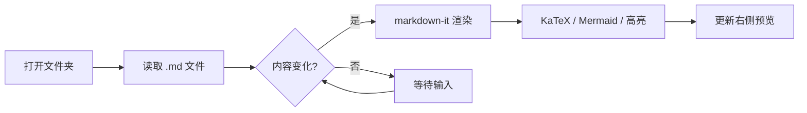
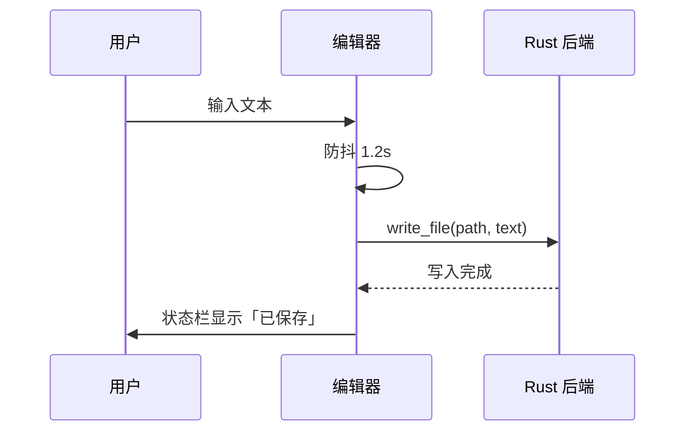

# Markdown 编辑器 —— 功能演示

这是一个用于验证渲染管线的示例文档。右侧预览应当**实时**跟随左侧输入更新。

## 1. 基础语法

普通段落，包含 **粗体**、*斜体*、***粗斜体***、~~删除线~~ 与 `行内代码`。

自动链接：https://tauri.app 与 <https://commonmark.org>

> 引用块可以嵌套：
>
> > 第二层引用
>
> 回到第一层

## 2. 列表与任务

- 无序列表项
  - 嵌套项
- 带 `inline code` 的项

1. 有序列表
2. 第二项
   1. 嵌套有序项

- [x] 已完成的任务
- [ ] 待办任务
- [ ] 另一个待办

## 3. 表格

| 功能 | 实现 | 状态 |
| --- | :---: | ---: |
| GFM 语法 | markdown-it | 完成 |
| 代码高亮 | highlight.js | 完成 |
| 数学公式 | KaTeX | 完成 |
| 图表 | Mermaid | 完成 |

## 4. 代码块

```ts
type Theme = "light" | "dark";

export function resolveTheme(stored: string | null): Theme {
  return stored === "dark" ? "dark" : "light";
}
```

```rust
#[tauri::command]
pub fn read_file(path: String) -> Result<String, String> {
    std::fs::read_to_string(&path).map_err(|e| e.to_string())
}
```

```bash
npm install
npm run app:dev
```

未标注语言的代码块按纯文本渲染：

```
plain text, no highlighting
$ not a formula here
```

## 5. 数学公式

行内公式：质能方程 $E = mc^2$，以及 $\sum_{i=1}^{n} i = \frac{n(n+1)}{2}$。

块级公式：

$$
\int_{-\infty}^{+\infty} e^{-x^2}\,\mathrm{d}x = \sqrt{\pi}
$$

矩阵：

$$
\begin{pmatrix}
a & b \\
c & d
\end{pmatrix}
\begin{pmatrix}
x \\
y
\end{pmatrix}
=
\begin{pmatrix}
ax + by \\
cx + dy
\end{pmatrix}
$$

## 6. 图表





## 7. 分隔线与图片

---

图片（相对路径，示例文件夹内没有图片时会显示占位）：


## 8. 长文档滚动测试

下面重复若干段落，用于测试滚动联动与大纲跳转。

### 8.1 小节一

Lorem ipsum dolor sit amet, consectetur adipiscing elit. 这一段用于撑高文档，便于观察编辑器与预览的滚动同步是否稳定。

### 8.2 小节二

Sed do eiusmod tempor incididunt ut labore et dolore magna aliqua. 滚动任意一侧，另一侧应按比例跟随。

### 8.3 小节三

Ut enim ad minim veniam, quis nostrud exercitation ullamco laboris.

### 8.4 小节四

Duis aute irure dolor in reprehenderit in voluptate velit esse cillum dolore.

## 9. 小结

以上内容覆盖了首版需要支持的全部语法。若某项渲染异常，请对照本文件排查对应的渲染阶段。
