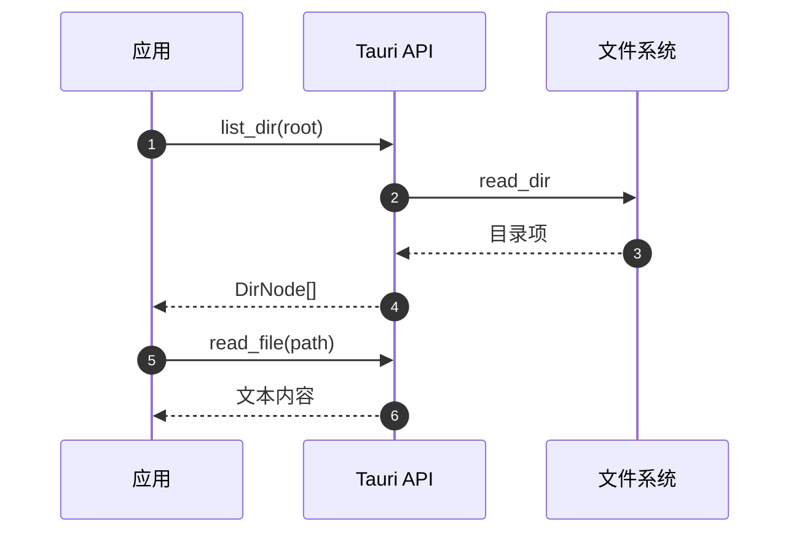
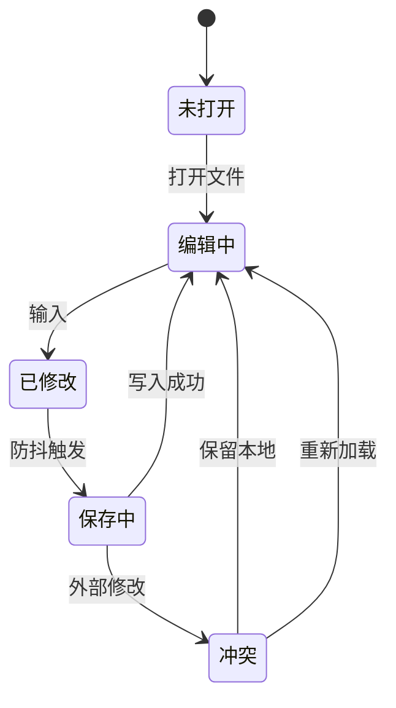
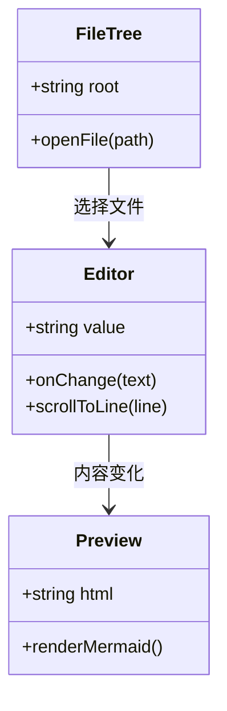
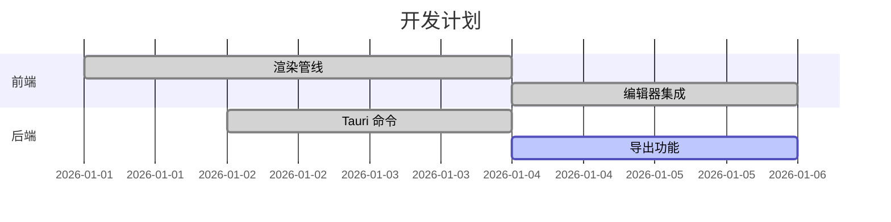
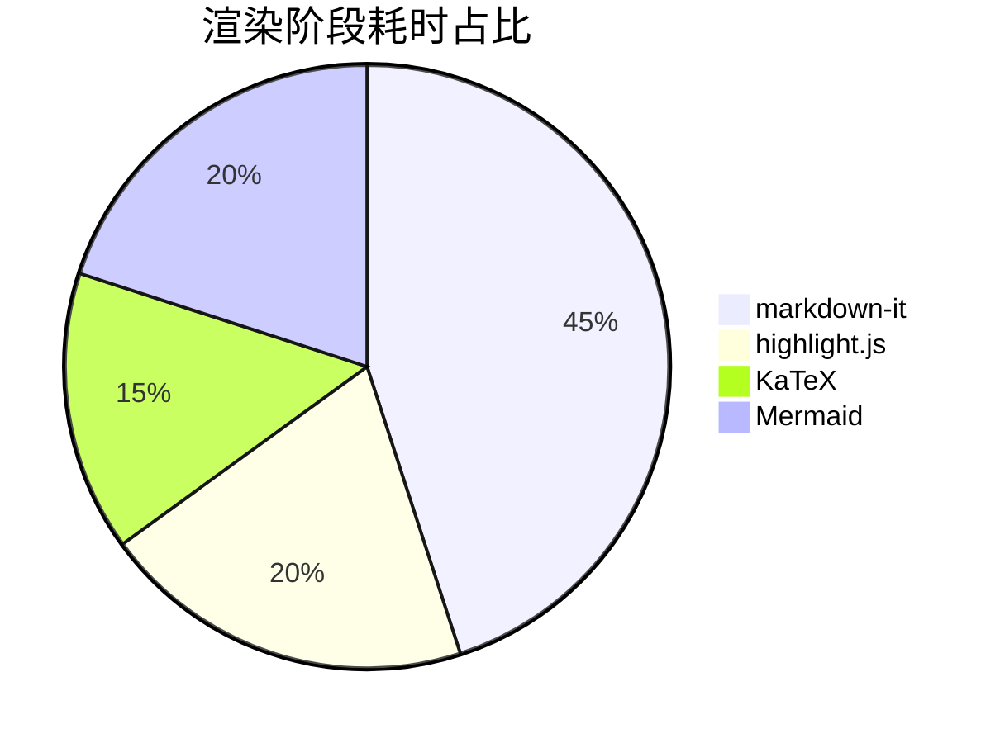

# 图表专项测试

本文件集中测试 Mermaid 的各类图表，用于排查渲染与主题切换问题。

## 流程图


## 时序图



## 状态图



## 类图



## 甘特图



## 饼图



## 错误处理测试

下面这个图表的语法是错的，预览区应当显示错误信息而不是整块空白：

```mermaid
flowchart LR
    A[未闭合的节点 --> B
```
